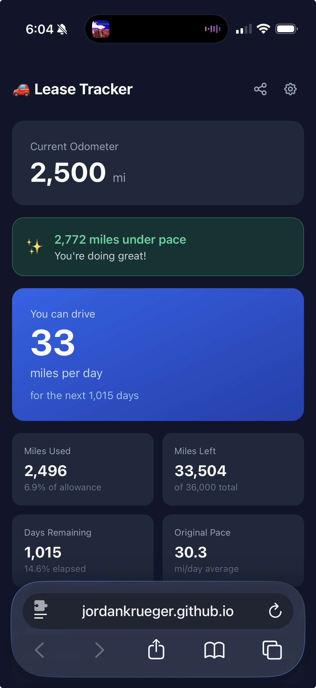

# Lease Mileage Tracker

> A simple, privacy-first car lease mileage tracker. See exactly how many miles per day you can drive without going over your limit. No signup, no backend, no tracking.

[](https://jordankrueger.github.io/lease-tracker/)


**[→ Open the live demo](https://jordankrueger.github.io/lease-tracker/)**

<p align="center">
  
</p>

## The problem

You signed a lease for, say, 36,000 miles over 3 years. Halfway through, you have no idea if you're on pace, behind, or about to get hit with a $0.25/mile overage charge at lease-end. Most lease apps want you to sign up, hand over your VIN, and look at ads.

## What this does

Enter four things once: lease start date, end date, total miles allowed, and your starting odometer. The app shows you:

- **How many miles per day you can still drive** for the rest of the lease
- Whether you're **ahead of pace or behind**, in plain miles
- **Days remaining**, miles used, miles left
- A simple progress bar comparing miles used vs time elapsed

Tap your odometer once a week (or whenever) to update. That's the whole interaction.

## Features

- 📊 **Real daily allowance** — recalculates from your actual mileage and remaining days, not from the original lease average
- 🎯 **Pace tracking** — at-a-glance "you're 1,200 miles under pace" indicator
- 🔗 **Shareable lease terms** — generate a link for a co-driver or partner; their odometer stays separate
- 📱 **Installable PWA** — add to your phone's home screen, open like a native app, works offline
- 🔒 **Truly private** — no signup, no analytics, no servers. Your data lives in your browser and in the URL.
- 🌐 **Works offline** after first load, thanks to a service worker
- 🪶 **Single HTML file** — no build step, no dependencies to install, fork-and-deploy in 2 minutes

## How your data is stored

This app has no backend. Your data is stored in two places, both on your device:

1. **In the URL itself.** Every time you update your odometer, the page URL updates with your full state encoded as parameters. **Bookmark the page** and you've effectively backed up your data — even if your browser clears site storage, opening the bookmark restores everything.
2. **In `localStorage`** as a convenience cache, so opening the bare URL also works.

This matters because **Safari and other browsers periodically wipe localStorage** for sites that haven't been opened in ~7 days (Apple's Intelligent Tracking Prevention). Storing state in the URL sidesteps that entirely. The URL is the source of truth.

**TL;DR:** bookmark the page after you set it up. The bookmark is your backup.

## Install as a Progressive Web App (PWA)

A PWA is a website you can install on your phone or computer like a regular app. No app store, no download. Just visit the site and add it to your home screen.

Once installed, Lease Tracker:
- Opens in its own window (no browser toolbar)
- Works offline
- Launches from your home screen, dock, or Launchpad with its own icon

### iPhone / iPad

1. Open [the live demo](https://jordankrueger.github.io/lease-tracker/) in **Safari** (iOS only allows PWA installs from Safari)
2. Tap the **Share** button (square with arrow pointing up)
3. Scroll down and tap **Add to Home Screen**
4. Tap **Add**

### Mac

**Safari (macOS Sonoma or later):**
1. Open the site in Safari
2. Click **File → Add to Dock**

**Chrome / Edge / Brave (any version):**
1. Open the site
2. Click the three-dot menu (top right)
3. Click **Install Lease Mileage Tracker** (or **Save and Share → Install**)
4. The app appears in your Applications folder and Launchpad

### Tip

Each install (iPhone, Mac, etc.) has its own storage. They don't sync. If you want the same data on multiple devices, share the URL between them — the URL carries the full state.

## Self-host your own copy

This is a single static HTML file plus an icon and a service worker. Anyone with a free GitHub account can host their own copy in about 2 minutes.

### Step 1 — fork or download

Either click **Fork** at the top of this repo, or download the files: `index.html`, `manifest.json`, `sw.js`, `icon-192.png`, `icon-512.png`.

### Step 2 — push to a new repo

If you forked, you're done with this step. Otherwise:

1. Create a new public repo at [github.com/new](https://github.com/new)
2. Upload all five files to the repo root (drag-and-drop in the GitHub web UI works)

### Step 3 — turn on GitHub Pages

1. In your repo, go to **Settings → Pages**
2. Under **Source**, pick **Deploy from a branch**
3. Pick `main` branch, `/ (root)` folder
4. Save

After a minute or two your app is live at `https://YOUR_USERNAME.github.io/YOUR_REPO_NAME/`.

### Step 4 (optional) — custom domain

1. Add a file named `CNAME` to your repo containing just your domain (e.g. `lease.example.com`)
2. In your DNS, add a CNAME record pointing to `YOUR_USERNAME.github.io`
3. In **Settings → Pages**, set the custom domain

## Customize

### Icons

The included icons are simple placeholders. To swap them:

1. Make a 512×512 PNG of your design
2. Use [favicon.io](https://favicon.io/) or [realfavicongenerator.net](https://realfavicongenerator.net/) to generate the 192×192 version
3. Replace `icon-192.png` and `icon-512.png`

### Colors / styling

Open `index.html` and edit the Tailwind classes directly. Theme color is `#0f172a` (slate-900) and is set in three places: the `<meta name="theme-color">`, `manifest.json`'s `theme_color`/`background_color`, and the body class.

## URL parameters

You can construct a URL by hand to pre-fill the setup form (handy for sharing or scripted setup):

| Param | Description | Example |
|---|---|---|
| `start` | Lease start date (YYYY-MM-DD) | `2024-01-15` |
| `end` | Lease end date (YYYY-MM-DD) | `2027-01-15` |
| `miles` | Total miles allowed | `36000` |
| `startOdo` | Odometer reading at lease start | `15` |
| `currentOdo` | Current odometer reading | `12500` |

Example backup URL (everything restored, app opens straight to the dashboard):

```
https://jordankrueger.github.io/lease-tracker/?start=2024-01-15&end=2027-01-15&miles=36000&startOdo=15&currentOdo=12500
```

The **Share** button inside the app generates a link with everything *except* `currentOdo`, so the recipient sees your lease terms but tracks their own odometer.

## How it works (under the hood)

- **One file:** `index.html` contains the entire app — React 18 (loaded from unpkg), Babel Standalone for in-browser JSX, and Tailwind CSS via CDN. No build step, no `npm install`.
- **Service worker:** `sw.js` caches the app shell so it works offline after first load. Cache uses relative paths so it works on GitHub Pages subpaths or custom domains without changes.
- **Persistence:** state is encoded in URL params via `history.replaceState` and mirrored to `localStorage`. The app also calls `navigator.storage.persist()` to ask the browser for durable storage.
- **No tracking:** no analytics, no fonts from Google, no telemetry. The only third-party requests are to unpkg (React, Babel) and jsdelivr/cdn.tailwindcss.com on first load — and after that the service worker serves them from cache.

## Local development

No build step needed. Open `index.html` in a browser, or for full PWA features (service worker requires a real origin):

```bash
npx serve .
```

## License

[GNU General Public License v3.0](https://choosealicense.com/licenses/gpl-3.0/) — fork it, modify it, deploy your own. Improvements via pull request welcome.

---

Built with React, Tailwind, and a single HTML file. No backend. No signup. No nonsense.
